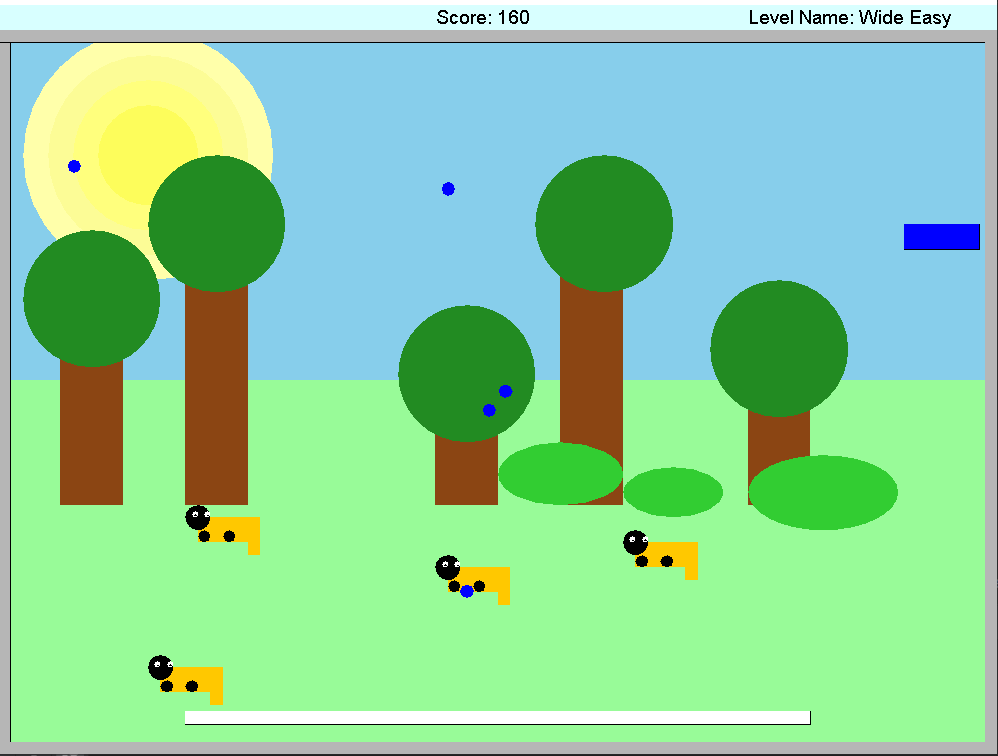
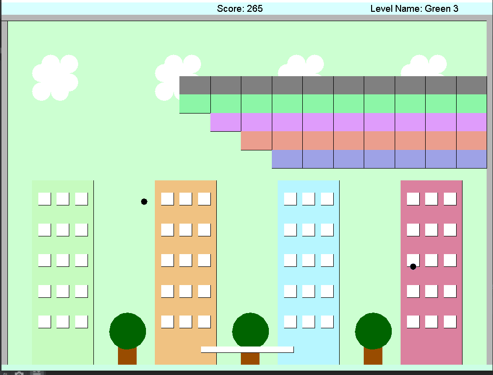

# Arkanoid-Game
# Arkanoid Game OOP

## Project Overview

Object-oriented programming project, Arkanoid game  

This project is an implementation of the classic Arkanoid game using Object-Oriented Programming (OOP) principles. The game involves controlling a paddle to bounce a ball and break bricks on the screen. The primary focus of the project was to create a modular and reusable codebase that adheres to OOP best practices.

## Features

- **Game Mechanics**: Includes paddle control, ball movement, brick collision detection, and score tracking.
- **Modular Design**: The game's architecture is designed for flexibility and reusability, making it easy to extend and maintain.
- **GUI**: Utilizes Java’s graphical user interface (GUI) components to create an interactive user experience.
- **OOP Principles**: The project emphasizes core OOP principles such as polymorphism, inheritance, delegation, and the use of abstract classes and design patterns like Observers.

## Screenshots

## How to Run

1. Clone the repository to your local machine.
2. Open the project in your preferred IDE.
3. Compile and run the main class to start the game.

## Technologies Used

- **Java**: Core programming language for implementing the game.
- **OOP Principles**: Utilized for structuring the game’s codebase.
- **Graphical User Interface (GUI)**: Implemented using Java’s GUI components.
